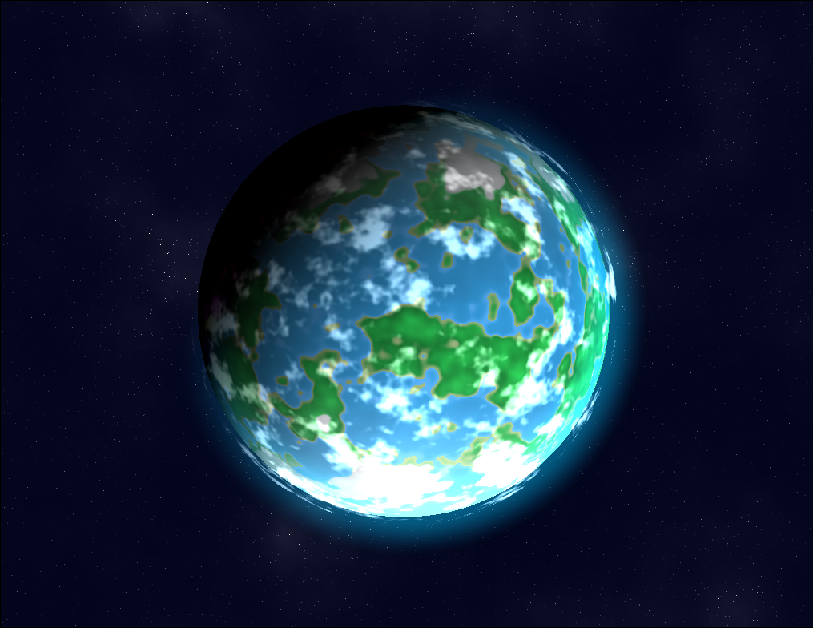

# a basic planet shader for wallpaper
---
> this is a c++ base fullscreen shader using opengl. 
> it uses glsl to emulate the rendering of a planet without any geometry
---
## current state of the project

